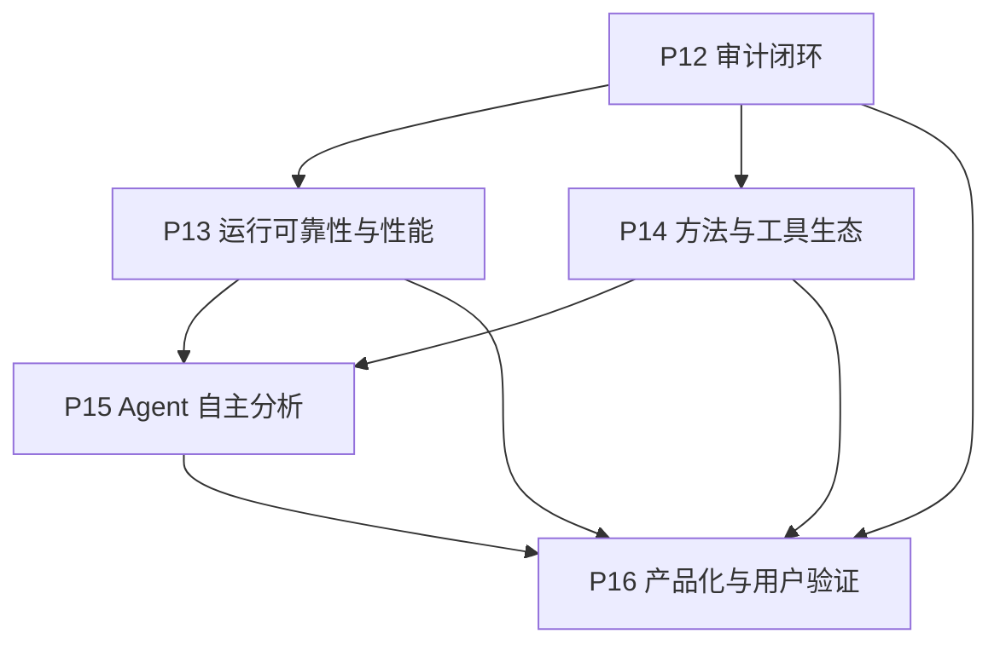

# P12—P16 依赖图

```mermaid
flowchart TD
  P12[P12 审计闭环] --> P13[P13 运行可靠性与性能]
  P12 --> P14[P14 方法与工具生态]
  P12 --> P16[P16 产品化与用户验证]
  P14 --> P15[P15 Agent 自主分析]
  P13 --> P15
  P13 --> P16
  P14 --> P16
  P15 --> P16
```

P12 必须先完成。P13/P14 可部分并行。P15 依赖执行反馈与方法接口稳定。P16 可先准备环境诊断与工作台技术验证，发布验收依赖其他阶段结果。
